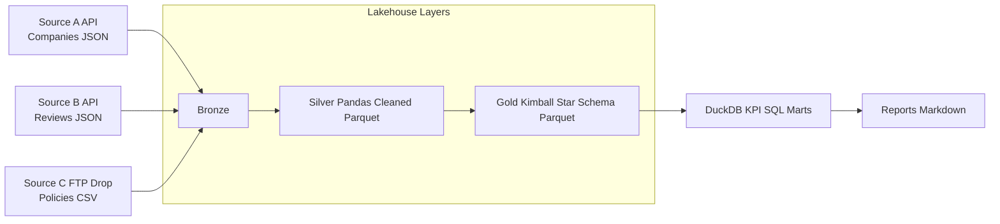
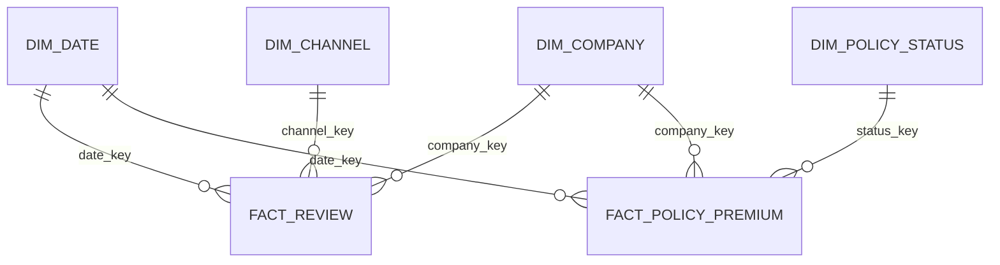

# Mini Lakehouse + Kimball Demo

This repository demonstrates a local, reproducible Lakehouse pipeline with Bronze, Silver, and Gold layers.  
It models a Company Reviews and Business Registry domain with deterministic synthetic data.  
The Gold layer implements Kimball star-schema dimensions and facts with surrogate keys and explicit grain.  
DuckDB SQL builds analytics-ready KPI marts directly from Parquet files.  

## Architecture



## Repository Layout

```text
lakehouse_demo/
  src/lakehouse/            # Pipeline code and CLI
  sql/marts/                # DuckDB KPI SQL
  data/                     # Bronze/Silver/Gold/Marts outputs
  docs/                     # Kimball model docs
  reports/                  # Generated markdown report
  tests/                    # Data quality tests
```

## How To Run

1. Use Python 3.11.
2. Change directory:
   ```bash
   cd lakehouse_demo
   ```
3. Install dependencies:
   ```bash
   make setup
   ```
4. Run full pipeline:
   ```bash
   make run
   ```
5. Run quality checks:
   ```bash
   make test
   ```
6. Run lint + format checks:
   ```bash
   make lint
   ```

You can run each stage independently:

```bash
python -m lakehouse ingest
python -m lakehouse silver
python -m lakehouse gold
python -m lakehouse mart
python -m lakehouse all
```

## Data Model (Kimball)

Gold layer star schema:



Fact grains:
- `fact_review`: one row per review event.
- `fact_policy_premium`: one row per policy per `start_date`.

Dimension highlights:
- `dim_date`: integer `date_key` (`YYYYMMDD`) plus calendar attributes.
- `dim_company`: surrogate key + natural business key (`company_id`).
- `dim_channel`, `dim_policy_status`: low-cardinality conformed lookup dimensions.

See [docs/star_schema.md](docs/star_schema.md) and [docs/kimball_notes.md](docs/kimball_notes.md).

## Included

- Lakehouse migration pattern: Bronze/Silver/Gold medallion structure mirrors enterprise lakehouse programs in Fabric/Databricks.
- Kimball modeling: clear star schema, defined fact grain, surrogate keys, and dimensional conformance.
- Integrations: simulates API ingestion (companies/reviews), FTP drop ingestion (policies), and SQL serving via DuckDB.
- Analytics readiness: curated Gold model and KPI marts are directly consumable by BI tools.
- Engineering quality: automated tests, linting, and CI represent Azure DevOps style gated delivery.
- Reproducibility: local-first and deterministic runs for onboarding, demos, and regression testing.


