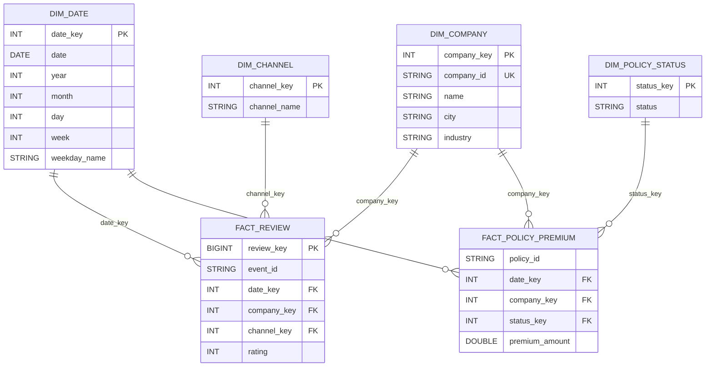

# Star Schema

The Gold layer follows Kimball dimensional modeling with conformed dimensions and two facts.

## Fact Grains

- `fact_review`: one row per review event.
- `fact_policy_premium`: one row per policy per `start_date`.
